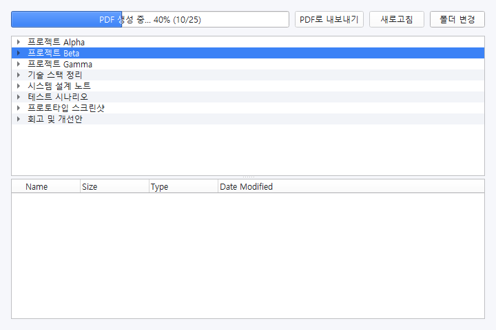

# Notion PDF Exporter

Notion 페이지를 선택하여 PDF로 내보내고, 스타일을 커스터마이즈할 수 있는 데스크탑 앱입니다.

---

빠른 미리보기



위 이미지는 다음 명령으로 자동 생성됩니다.

```powershell
python main.py --demo
```

데모 모드는 더미 목록과 일부 진행률을 연출하며, 창이 표시된 뒤 자동으로 `@image/ui_demo.png`에 캡처를 저장하고 종료합니다.

## 주요 특징

- Notion API를 통해 원하는 페이지를 선택, PDF로 변환 및 병합
- Playwright 기반의 고품질 PDF 렌더링
- CSS 커스터마이즈 지원 (`portfolio_style.css`)
- PySide6 기반 GUI

---

## 설치 및 환경설정 (Windows 기준)

### 1. Python 설치

- Python 3.9 이상 권장
- [python.org](https://www.python.org/downloads/)에서 설치

### 2. 가상환경(venv) 사용 권장

윈도우에서는 pyenv-win의 가상환경 기능이 불안정하거나, 명령어가 다를 수 있습니다.  
**가장 안정적인 방법은 내장 venv를 사용하는 것입니다.**

```powershell
cd C:\path\to\your\project
python -m venv .venv
.\.venv\Scripts\Activate
```

> PowerShell에서 실행하며, 가상환경이 활성화되면 프롬프트에 `(.venv)`가 표시됩니다.

### 3. 필수 패키지 설치

```powershell
pip install --upgrade pip
pip install -r requirements.txt
```

### 4. Playwright 브라우저 설치

Playwright는 별도의 브라우저 바이너리 설치가 필요합니다.

```powershell
playwright install
```
> 만약 `playwright` 명령어가 인식되지 않으면,  
> ```powershell
> python -m playwright install
> ```

### 5. .env 파일 설정

루트 폴더에 `.env` 파일을 만들고 아래처럼 Notion API 키를 입력하세요.

```
NOTION_API_KEY=your_secret_notion_api_key
```

---

## 설치 자동화 스크립트 (선택)

`install.ps1` 스크립트를 이용하면 위 과정을 한 번에 자동으로 진행할 수 있습니다.

1. PowerShell에서 프로젝트 폴더로 이동
2. 아래 명령어로 실행 정책을 일시적으로 허용

```powershell
Set-ExecutionPolicy -ExecutionPolicy RemoteSigned -Scope Process
```

3. 설치 스크립트 실행

```powershell
./install.ps1
```

설치가 완료되면 `.env` 파일을 직접 생성해야 합니다.

---

## 실행 방법

1. (가상환경이 꺼져 있다면) 가상환경 활성화

```powershell
.\.venv\Scripts\Activate
```

2. `.env` 파일에 Notion API 키가 입력되어 있는지 확인

3. 프로그램 실행

```powershell
python main.py
```

---

## 시행착오 및 환경설정 팁

- **pyenv-win의 virtualenv 명령어는 Windows에서 제대로 동작하지 않을 수 있습니다.**  
  → 내장 venv 사용을 권장합니다.
- **playwright 설치 후 반드시 playwright install을 실행해야 PDF 생성이 정상 동작합니다.**
- **가상환경을 활성화하지 않으면 패키지 인식 오류가 발생할 수 있습니다.**
- **환경변수 PATH에 pyenv-win 경로가 중복되거나 잘못 등록되어 있으면 pyenv 명령어가 오동작할 수 있습니다.**
- **requirements.txt에 명시된 패키지 외에, 시스템에 git, Microsoft Visual C++ Build Tools 등이 필요할 수 있습니다.**

---

## 기타

- CSS 스타일은 `portfolio_style.css`에서 자유롭게 수정할 수 있습니다.
- PDF 병합 결과물은 `.etc/` 폴더에 저장됩니다.

---

## 문의

환경설정이나 실행 중 문제가 발생하면,  
오류 메시지와 함께 이슈를 남겨주세요.
